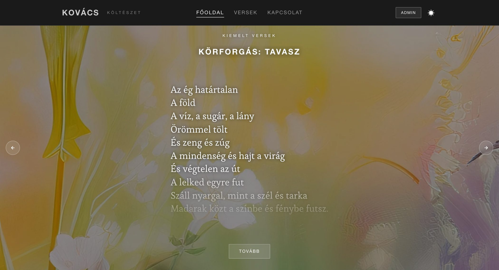
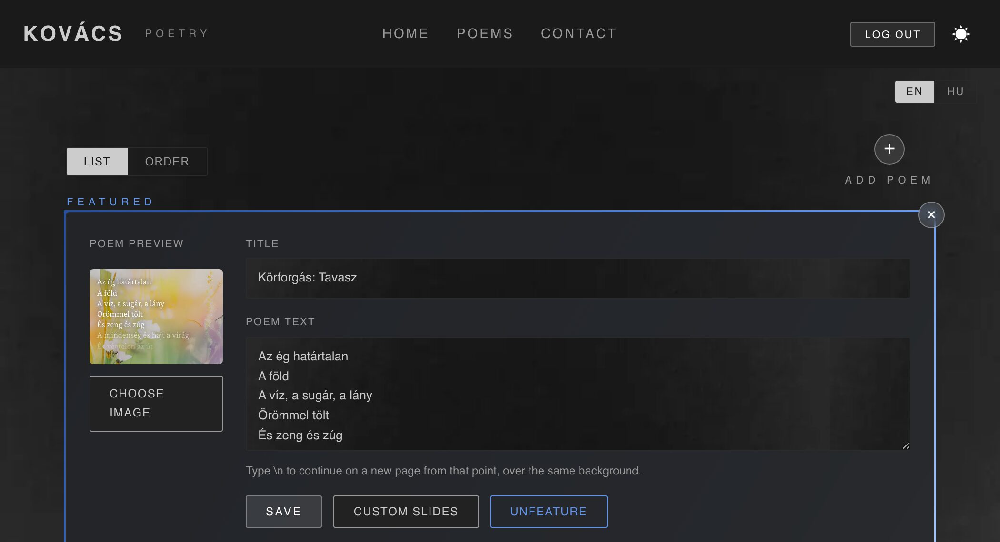
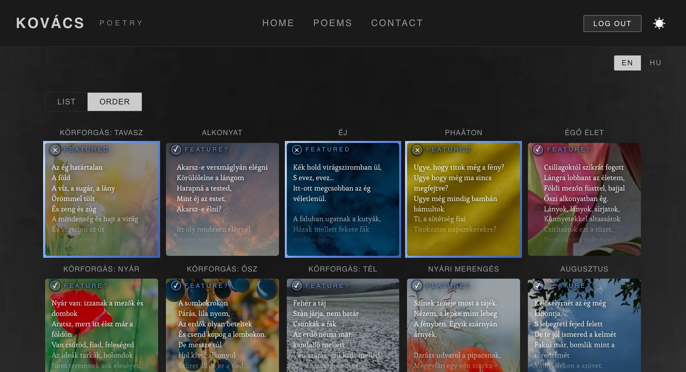

# Kovács — Modern Poetry Portfolio

Bilingual (Hungarian/English) poetry portfolio. Every route is prerendered to static HTML, so
the poems are indexable without JavaScript, and an admin portal edits the content live.

[](https://github.com/Artoriun/kov-cs-poetry/actions/workflows/ci.yml)

**Live:** https://artoriun.github.io/kov-cs-poetry/




---

## Lighthouse

Measured against the live deploy. CI runs the same audit on every push and gates
accessibility, best practices and SEO at 100.

<br>
**Mobile** — LCP 2.7s · CLS 0 · TBT 0ms

<br>
**Desktop** — LCP 0.6s · CLS 0.004 · TBT 0ms

---

## Stack

| | |
| --- | --- |
| **Front end** | React, TypeScript, Vite, Motion |
| **Back end** | Express, Firestore |
| **Media** | Cloudinary |
| **Tooling** | TurboRepo, Biome, Playwright |
| **Hosting** | GitHub Pages (site) · Render (API) |

Three workspaces: `packages/web`, `packages/api`, `packages/shared`.

---

## Quick start

```bash
npm install
npm run dev      # web + API, with /api proxied in development
```

Copy `.env.example` to `packages/api/.env` and set at least:

```bash
ADMIN_PASSWORD=          # or ADMIN_PASSWORD_HASH from `npm run hash-password`
JWT_SECRET=
FIREBASE_PROJECT_ID=     # plus CLIENT_EMAIL, PRIVATE_KEY, STORAGE_BUCKET
CLOUDINARY_URL=
```

Contact email (`RESEND_API_KEY` or SMTP) is optional — without it the form returns 503 rather
than dropping messages. The site also runs with no API at all: the poems are in the bundle,
and the portal is simply unreachable.

### Scripts

```bash
npm run build            # production build
npm run prerender        # static HTML per route, sitemap and robots
npm run ci               # everything CI runs, in order
npm run test:e2e         # Playwright, four viewport and touch profiles
npm run check:lighthouse # accessibility / SEO / best-practices gate
npm run hash-password    # prints an ADMIN_PASSWORD_HASH
npm run backup-poems     # writes the live poems to backups/
```

---

## Features

- **Reader** — full-screen poem pages, vertical swipe between pages, staggered line reveals,
  and a dedicated landscape layout
- **Prerendered** — one HTML file per route with its own title, description, canonical and
  structured data; the poem text is in the markup before any script runs
- **Bilingual** — Hungarian and English, switchable, portal included
- **Light and dark** themes, WCAG AA contrast, `prefers-reduced-motion` respected
- **Contact form** with validation, a honeypot and per-IP rate limiting
- **Images** sized per device through Cloudinary; the body font is self-hosted

---

## Admin portal

Password login with JWT auth at `/admin`. Create, edit, delete and drag-to-reorder poems,
feature them on the home carousel, and upload images.

**List** is where a poem is written: the image preview sits beside the fields that produce it,
because the text is laid over the image rather than beside it. **Order** is the same poems as
cards, dragged into the sequence readers meet them in.





Edits are live for visitors immediately. The prerendered HTML that crawlers read is a
build-time snapshot and catches up on the next deploy — weekly by cron, or on demand.

### Page breaks

Typing `\n` in a poem's text marks where it continues on a new page over the same background.
It is part of the poem text, so it needs no schema change, and a poem without one is a single
page. The reader never merges across a break, and still subdivides one further if it is too
tall for the viewport.

---

## Testing

`npm run ci` runs the pipeline in CI's order: Biome, `tsc`, API and unit tests, Playwright
layout tests across four viewport and touch profiles, an axe accessibility sweep in both
themes, a gzipped bundle budget, a first-paint-versus-hydrated check, and Lighthouse against
the built output.

Poems and images are stubbed in the layout tests, so the suite is deterministic and needs no
network.

---

## Deployment

- **Site → GitHub Pages** on push to `main`; the deploy job needs every check to pass first.
- **API → Render** (free tier). Set `CORS_ORIGIN` there, and add the API URL as the
  `VITE_API_URL` GitHub Actions secret.
- Prerendered HTML is a snapshot, so a weekly cron rebuild keeps crawlers current.
- **Node 22** is required (`.nvmrc`).

Poems live in `packages/shared/src/index.ts` as a fallback; portal edits are stored in
Firestore and take precedence at runtime.

---

## Licence

MIT — see [LICENSE](LICENSE).
